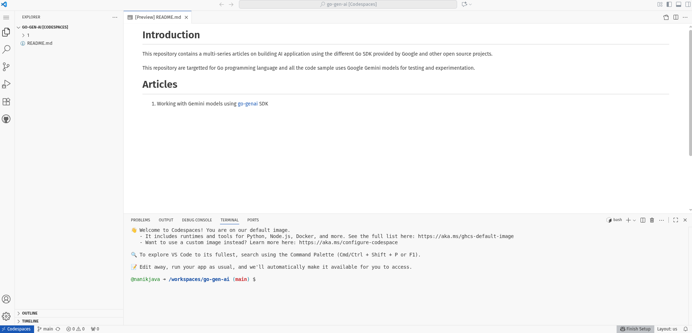
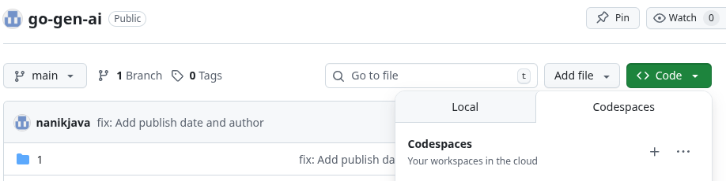
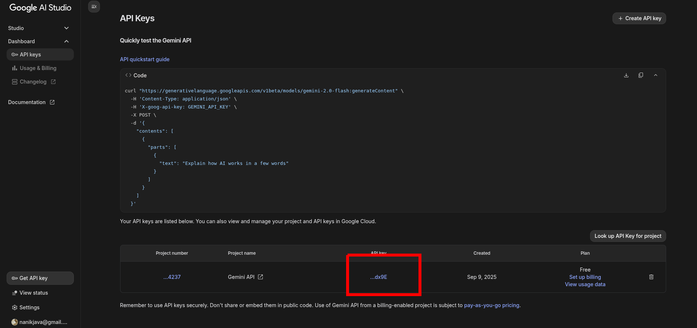
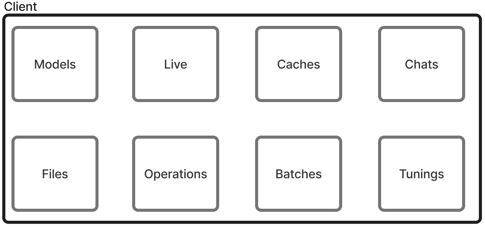

| Publish Date       | Author                                        |
| ---                | ---       |
| September 14, 2025 | Nanik Tolaram (nanikjava@gmail.com)           |
|                 |       |


# go-genai

Google Gemini provides a lot of different models for text, images and videos. To assist developer in developing AI application using the different models Google have come up with the `go-genai` [SDK](https://github.com/googleapis/go-genai). This frees up developer to focus on their application rather than fiddling around with different calls and parameters when using the model. The SDK streamline the development process for different kind of data - text, image or video and have capability to support different kind of streaming modes.

In this article we will look at examples on how to use the SDK and at the same time try to look at what packages are provided inside the SDK.

# Codespace setup

Codespace is the easiest way to kick start using the code in this repo as it gives you the ability to work on a project without checking out the code on your local development machine. 


Use the codespace menu as shown in the diagram below



Once codespace is launched you are ready to work with the code in this repo as the Go tooling is included.

# Example

The code example for this article is an application that will send an image to the model and asked it to describe what kind of instrument it is. We will be using the `gemini-2.0-flash` model. Code can be seen inside the `code` folder.


## Running the code

Before running the code get an API from [Google AI Studio](https://aistudio.google.com/) website. Following screenshot shows the screen that you can get the API key from



Change to the `1/code` directory from the terminal and run the sample application as follows:

```
GEMINI_API_KEY=<your_api_key> go run main.go
```

On successful run you will see output something like the following:

```
2025/09/13 10:33:27 Yes
2025/09/13 10:33:27 , absolutely!
2025/09/13 10:33:27  I'd love to learn about a musical instrument you want to show me. You
2025/09/13 10:33:27  can describe it in detail, tell me what kind of sounds it makes, its
2025/09/13 10:33:28  history, or anything else you find interesting. The more information you provide, the better I can understand and engage with you. 

Go ahead, I'm ready to
2025/09/13 10:33:28  hear about it! 

2025/09/13 10:33:28 ________________________________________________________________
2025/09/13 10:33:31 The
2025/09/13 10:33:31  instrument in the
2025/09/13 10:33:31  image is a saxophone. It belongs to the **woodwind** family of musical
2025/09/13 10:33:31  instruments.
+
2025/09/13 10:33:31 ________________________________________________________________
```

## Inside the code

Let's take a look at how the example is using the SDK. The app first initialize the SDK with the API key:

```
	ctx := context.Background()
	client, err := genai.NewClient(ctx, &genai.ClientConfig{
		APIKey:  os.Getenv("GEMINI_API_KEY"),
		Backend: genai.BackendGeminiAPI,
	})
```

The API key is passed using the `GEMINI_API_KEY` environment variable. The `Backend` parameter inform the SDK that the application will be using Gemini. The other backend option is `BackendVertexAI` that uses the [Google Vertex AI](https://cloud.google.com/vertex-ai) that provide fully-managed AI development platform for building generative AI.

There are a number of packages available inside the SDK and one of them is the `Chats`

```
	chat, err := client.Chats.Create(ctx, "gemini-2.0-flash", nil, nil)
```


The code now has complete the initialization process so the next thing we want to do is to trigger a conversation with
the LLM. 

```
	for chunk, err := range chat.SendMessageStream(ctx, genai.Part{
		Text: "Hello, I'm interested in learning about musical instruments. Can I show you one?"}) {
		if err != nil {
			log.Fatal(err)
		}
		log.Println(chunk.Text())
	}
```

The code above uses the `SendMessageStream` function that enables it to stream the reply coming in from the LLM. This gives the application capability to stream response back to the user as and when they arrive. The function accept a `genai.Part` parameter which is a struct used to inform the SDK what is the prompt we would like to send to the LLM.

The code will keep on streaming the response from the LLM to the user until it stops sending any response. As developer we don't have to worry when we start or end the conversation with the LLM.

Now that we have start a generic conversation with the LLM, we going to step it up. We going to upload an image and asked LLM to identify the type of music instrument. The image will need to be uploaded first from the local drive performed by the following code. 

The code uses the `Files` package from the SDK that provide numerious file operation functionality.


```
	image, err := client.Files.UploadFromPath(
		ctx,
		filepath.Join(util.GetMedia(), "saxophone.png"),
		&genai.UploadFileConfig{
			MIMEType: "image/png",
		},
	)
```

Now, that we have uploaded the image to the cloud we can send the question prompt to the LLM to tell us what kind of instrument it is. We are send 2 kind of information to the LLM - the question prompt and the image URL for the LLM.

```
	parts := make([]genai.Part, 2)
	parts[0] = genai.Part{Text: "What family of instruments does this instrument belong to?"}
	parts[1] = genai.Part{
		FileData: &genai.FileData{
			FileURI:  image.URI,
			MIMEType: image.MIMEType,
		},
	}
```

Getting the response back from the LLM is the same like explained before using the `SendMessageStream`.

```
	for chunk, err := range chat.SendMessageStream(ctx, parts...) {
		if err != nil {
			log.Fatal(err)
		}
		log.Println(chunk.Text())
	}
```

That complete code explanation for the example. Next section we will look at the packages used in the code example.

# Internals

The entry point for the SDK is through the `NewClient` that initialize the `Client` struct that host several other struct as shown in the diagram.



We going to look at 2 packages that we used in the example `Files` and `Chat`

## Files

The `Files` struct contains file operation function. The functions gives developer the ability to upload, delete, list, etc that are uploaded. This is useful when building application that require the LLM to work with a number of files to extract information.

## Chats

The `Chats` struct provide function that make it easy for developer to interface with the models. The basic principle of working with model is the ability to send prompt and receive response which are provided. 