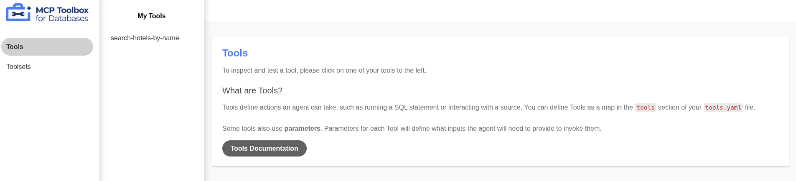

| Publish Date       | Author                                        |
| ---                | ---       |
| September 17, 2025 | Nanik Tolaram (nanikjava@gmail.com)           |
|                 |       |

# Setup

The example in this article will be run inside a GitHub Codespace for convenience, but the same instructions also work on a local development machine. Codespace provides all the Golang tooling required to run the example in this article, so no extra steps required once your codespace is launched.

# Introduction

In this article we will build a simple travel agent that will use LLM to assist in finding hotels. In order to get a better understanding about what the code is doing there are few concepts that need to be understood:

* Tools
* MCP (Model Context Protocol)

We will look at how to build an AI application using MCP and build our tool to be used by the LLM.

## Tools

The basic usage to build an AI application is to perform Q&A operation where we asked question to the LLM and it will response back. Question arises now - what if we want to asked LLM questions based on data that we have ? also, we would like to use a number of existing functionality that we have to collate the data required for the LLM ?. 

LLM provide this functionality and it's called `tools`. Tools are basically any operation that we give to LLM to perform to get more data that we will be useful to fullfill a request. Imagine a use case where we want to build a smart travel agent that will find us the best hotel deals based on the criteria that we give it, we will give instruction to the LLM that we have tools that it can use to get more information about hotels and that tool will query different hotel API provider. The tool will collate the data and pass it to the LLM which will be used to get the information requested by the user.

## MCP

MCP stands for [Model Context Protocol](https://modelcontextprotocol.io/docs/getting-started/intro) is an open-source standard for connecting AI applications to external systems. Using MCP, AI applications can connect to data sources (e.g. local files, databases, etc), tools (e.g. search engines, API, etc) enabling them to access key information and perform tasks.

Some valid MCP use cases:

* **Monitoring & infra** – Connect MCP to Prometheus metrics or Traefik logs, so the AI application can answer things like `why is Service A latency spiking?` using live data.

* **Team workflow** – Hook MCP to tools like Jira or GitHub, so you can ask question like `show me all PRs that touch the payment system` or `create a Jira ticket for API contract update`

# MCP Toolbox 

Building MCP based application does not require you to build a brand new service with all the bells and whistles. Existing services that are already providing data that is required for your AI application can be reused. Complexity of maintaining MCP service will increases as more data are required for your AI applications, similar to how we normally design an API based application.

In this article we will be using an open source project called [MCP Toolbox](https://github.com/googleapis/genai-toolbox). The nice thing about the tool is it makes it easy to kickstart development of AI application without worrying about the plumbing of writing a lot of code. In fact, by doing this we will be able to move faster in development time without integrating with different libraries and framework to expose our service.

Once if the toolbox outgrow your MCP requirement then it will makes more sense to explore other avenue and alternative.

## Setting up

We will be using the binary version of MCP toolbox, so first we will need to find the latest version available from the project's [release page](https://github.com/googleapis/genai-toolbox/releases). For this article we are using version 0.14.0.

To install the application we use the following command

```
go install github.com/googleapis/genai-toolbox@v0.14.0
```

Run the following command to ensure that the toolbox is installed correctly:

```
genai-toolbox --help
```

You should see output something like the following

```
Usage:
  toolbox [flags]

Flags:
  -a, --address string                  Address of the interface the server will listen on. (default "127.0.0.1")
      --disable-reload                  Disables dynamic reloading of tools file.
  -h, --help                            help for toolbox
      --log-level stringLevel           Specify the minimum level logged. Allowed: 'DEBUG', 'INFO', 'WARN', 'ERROR'. (default info)
      --logging-format logFormat        Specify logging format to use. Allowed: 'standard' or 'JSON'. (default standard)
  -p, --port int                        Port the server will listen on. (default 5000)
      --prebuilt string                 Use a prebuilt tool configuration by source type. Cannot be used with --tools-file. Allowed: 'alloydb-postgres-admin', 'alloydb-postgres', 'bigquery', 'clickhouse', 'cloud-sql-mssql', 'cloud-sql-mysql', 'cloud-sql-postgres', 'dataplex', 'firestore', 'looker', 'mssql', 'mysql', 'oceanbase', 'postgres', 'spanner-postgres', 'spanner'.
      --stdio                           Listens via MCP STDIO instead of acting as a remote HTTP server.
      --telemetry-gcp                   Enable exporting directly to Google Cloud Monitoring.
      --telemetry-otlp string           Enable exporting using OpenTelemetry Protocol (OTLP) to the specified endpoint (e.g. 'http://127.0.0.1:4318')
      --telemetry-service-name string   Sets the value of the service.name resource attribute for telemetry data. (default "toolbox")
      --tools-file string               File path specifying the tool configuration. Cannot be used with --prebuilt, --tools-files, or --tools-folder.
      --tools-files strings             Multiple file paths specifying tool configurations. Files will be merged. Cannot be used with --prebuilt, --tools-file, or --tools-folder.
      --tools-folder string             Directory path containing YAML tool configuration files. All .yaml and .yml files in the directory will be loaded and merged. Cannot be used with --prebuilt, --tools-file, or --tools-files.
      --ui                              Launches the Toolbox UI web server.
  -v, --version                         version for toolbox
```

Now you all set, the next step we will configure toolbox.

## Configuration

We will now create configuration that will be passed to the toolbox. This configuration will contain the tool that we will need to use for our AI application. The configuration can be seen inside the `tools.yaml` file which look like the following

```
sources:
  hotel-source:
    kind: http
    baseUrl: https://gist.githubusercontent.com/nanikjava/761db1bbe779d1f675f870013da5896a/raw/93fa3810c5740db6d4b8ec9660be45eff311c4d2/hotels.txt
    timeout: 10s # default to 30s

tools:
    search-hotels-by-name:
        kind: http
        source: hotel-source
        method: GET
        path: /
        description: Tool to update information to the example API

toolsets:
    hotel:
        - search-hotels-by-name
```

Let's break the configuration piece by piece to understand what it means:

* `sources` - This specify the data source that we would like to use. In our example we are going to get the data from a gist endpoint.
* `tools` - This section specified the configuration of the tool that we want to expose to LLM called `search-hotels-by-name` that consumes the `hotel-source` data
* `toolsets` - This tells toolbox that we have a collection of tools that we are categorizing as `hotel` which we will use as parameter in our application. 

To run toolbox with the configuration make sure in the terminal you are inside the `2/code` directory to execute the following command:

```
genai-toolbox --ui --tools-file tools.yaml --log-level DEBUG
```

Once successful launch you will see the following output in terminal

```
2025-09-17T10:50:06.20022994Z INFO "Initialized 1 sources." 
2025-09-17T10:50:06.200287217Z INFO "Initialized 0 authServices." 
2025-09-17T10:50:06.200550469Z INFO "Initialized 1 tools." 
2025-09-17T10:50:06.200730335Z INFO "Initialized 2 toolsets." 
2025-09-17T10:50:06.201505675Z DEBUG "server listening on 127.0.0.1:5000" 
2025-09-17T10:50:06.201661295Z INFO "Server ready to serve!" 
2025-09-17T10:50:06.201747286Z INFO "Toolbox UI is up and running at: http://127.0.0.1:5000/ui" 
2025-09-17T10:50:06.201870705Z DEBUG "Starting a HTTP server." 
2025-09-17T10:50:06.202060852Z DEBUG "Added directory . to watcher." 
```

Toolbox is ready to be accessed and you can access by hitting the endpoint provided - which in this case it's `http://127.0.0.1:5000/ui` that looks like the following.



Our tools are now ready to be used by the LLM to get the data it will required. Now, what's left running the application which we will see in the next section.

# Simple Hotel Agent

The example in this article is a simple hotel agent assistant that will assist question about hotels. 

## Setting up

Before running the code make sure you have Gemini API key which you can obtained for free from the [Google AI Studio website](https://aistudio.google.com/).

## Running

Using the Gemini API key you got from the AI studio you can run in the terminal the example using the following command:

```
GEMINI_API_KEY=<api_key> go run main.go
```

On successful run you will see output that looks like the following

```
2025/09/17 10:56:51 --- Gemini requested function call: search-hotels-by-name ---
...
hotel_name,hotel_star_rating,hotel_country
Grand Palace Hotel,5,USA
Ocean View Resort,4,USA
The Downtown Suites,3,USA
```

The question that we asked Gemini is the following

```
Find from the list hotels that is in USA. Only return the hotel name, currency and country
```

The LLM return the data that it obtained from the tool that we hosted in Toolbox.

In the terminal where Toolbox is running you will see something like the following in the log, showing that the tool hosted in Toolbox has been executed.

```
...
...
2025-09-17T10:56:50.289547416Z INFO Response: 200 OK service: "httplog" httpRequest: {url: "http://localhost:5000/api/toolset/hotel" method: "GET" path: "/api/toolset/hotel" remoteIP: "127.0.0.1:35794" proto: "HTTP/1.1" requestID: "codespaces-082143/dtsAtRzpKc-000001"} httpResponse: {status: 200 bytes: 175 elapsed: 0.138600} 
2025-09-17T10:56:51.362201008Z DEBUG "tool name: search-hotels-by-name" 
2025-09-17T10:56:51.362232697Z DEBUG "tool invocation authorized" 
2025-09-17T10:56:51.362290735Z DEBUG "invocation params: []" 
2025-09-17T10:56:51.663793442Z INFO Response: 200 OK service: "httplog" httpRequest: {url: "http://localhost:5000/api/tool/search-hotels-by-name/invoke" method: "POST" path: "/api/tool/search-hotels-by-name/invoke" remoteIP: "127.0.0.1:35794" proto: "HTTP/1.1" requestID: "codespaces-082143/dtsAtRzpKc-000002"} httpResponse: {status: 200 bytes: 733 elapsed: 301.604807} 
...
...
```

So, how does this work ? what is the magic behind all this ?. We will look in detail in the next section.

## Code Diving

So what's happening here ? we have Toolbox, LLM and application working together in tandem to answer our hotel question. Let's break it down part by part.

The first thing what the code is doing is as follows:

```
...
...
	ctx := context.Background()
	apiKey := os.Getenv("GEMINI_API_KEY")
	toolboxURL := "http://localhost:5000"

	// Initialize the Google GenAI client using the explicit ClientConfig.
	client, err := genai.NewClient(ctx, &genai.ClientConfig{
		APIKey: apiKey,
	})
...
...    
```

The code pass the `GEMINI_API_KEY` into Google GenAI SDK to initialize it. Once successfull the code then try to connect to Toolbox and use the `LoadToolset` function from the Toolbox SDK to load the toolset that have declared previously. The Toolbox act like a repository of the tools that we have developed to be consumed by LLM. 


```
...
...
	// Initialize the MCP Toolbox client.
	toolboxClient, err := core.NewToolboxClient(toolboxURL)
...
	// Load the tools using the MCP Toolbox SDK.
	tools, err := toolboxClient.LoadToolset("hotel", ctx)
...
...
```

Now that we have access to Toolbox we need to construct the tooling information into a structure that can be used by the GenAI SDK. This is required as the LLM except certain format for the tooling to be passed to itself so that it knows what are things it need to provide in order to call the tool via the SDK. The code below perfor the conversion operations.

```
...
...

	genAITools := make([]*genai.Tool, len(tools))
	toolsMap := make(map[string]*core.ToolboxTool, len(tools))

	for i, tool := range tools {
		// Convert the tools into usable format
		genAITools[i] = ConvertToGenaiTool(tool)
		// Add tool to a map for lookup later
		toolsMap[tool.Name()] = tool
	}
...
...
```

We are now at the stage where we can connect to Toolbox and has converted the tooling information for LLM, so the next step for the code is to send all this information including the prompt or question we would like to asked in the following code. We are using the `gemini-2.0-flash` model.

```
...
...

	// Set up the generative model with the available tool.
	modelName := "gemini-2.0-flash"

	query := `You are a hotel expert: 
...
...
	config := &genai.GenerateContentConfig{
		Tools: genAITools,
		ToolConfig: &genai.ToolConfig{
			FunctionCallingConfig: &genai.FunctionCallingConfig{
				Mode: genai.FunctionCallingConfigModeAny,
			},
		},
	}
...
...
	genContentResp, _ := client.Models.GenerateContent(ctx, modelName, contents, config)
...
...
```

At this stage now we are calling LLM and waiting for response back. The response that we received will need to be checked whether there is a request coming in from LLM to execute any kind of tool operation, which is perform by the following block of code:

```
...
...
	functionCalls := genContentResp.FunctionCalls()
	if len(functionCalls) == 0 {
		log.Println("No function call returned by the AI. The model likely answered directly.")
		return
	}

	// Process the first function call (the example assumes one for simplicity).
	fc := functionCalls[0]
	log.Printf("--- Gemini requested function call: %s ---\n", fc.Name)
	log.Printf("--- Arguments: %+v ---\n", fc.Args)

	var toolResultString string

	if fc.Name == "search-hotels-by-name" {
		tool := toolsMap["search-hotels-by-name"]
		toolResult, err := tool.Invoke(ctx, fc.Args)
		toolResultString = fmt.Sprintf("%v", toolResult)
		if err != nil {
			log.Fatalf("Failed to execute tool '%s': %v", fc.Name, err)
		}
...
...
```

In the code above you can see we are performing `if` checking operation to see if the function call requested by LLM match with the one we are interested in, which in this case is `search-hotels-by-name`. If it match it will invoke the tool by using the `tool.Invoke` function which will call the tool hosted inside Toolbox.

On completion of calling the tool and obtaining the result we will now pass more prompts including the data obtained to the LLM as shown in the below code:

```
...
...

	resultContents := []*genai.Content{
		genai.NewContentFromText("You are given the following hotel data in CSV format:"+toolResultString+
			"Task: Answer questions by filtering this dataset based on the criteria provided."+
			"Find all hotels that are located in USA."+
			"Only return the hotel name, rating and country", genai.RoleUser),
	}
	finalResponse, err := client.Models.GenerateContent(ctx, modelName, resultContents, &genai.GenerateContentConfig{})
...
...
```

The final response coming back from LLM is the result that we will display to the user as it will contain the data returned based on the query asked by the user.

```
...
...
	log.Println("=== Final Response from Model (after processing function result) ===")
	printResponse(finalResponse)
...
...
```

# Summary

Let's recap what we have learn so far:

* MCP Toolbox is a good start to play around with MCP. No extra setup or code required for building MCP application.
* Existing source like data, API, etc can be reused as part of your AI application.
* Toolbox provide all the heavy lifting required for MCP application and can be integrated easily in application using it's SDK.

