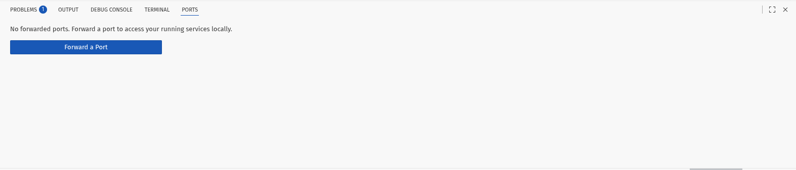
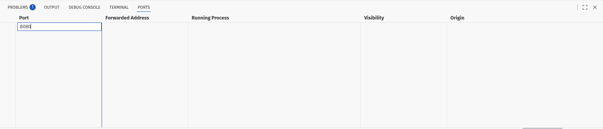
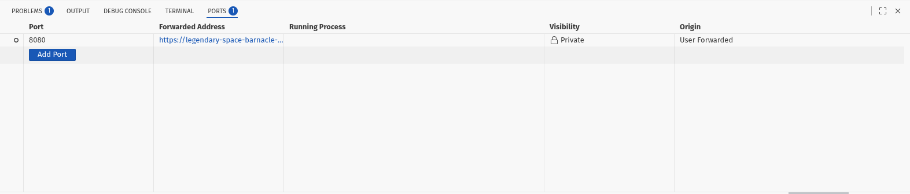
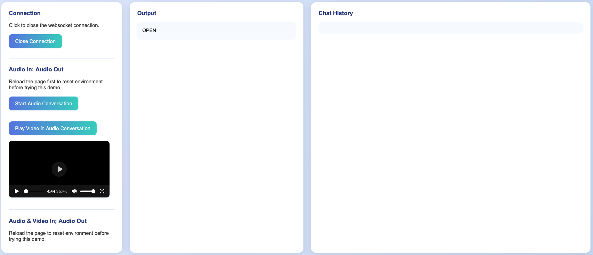
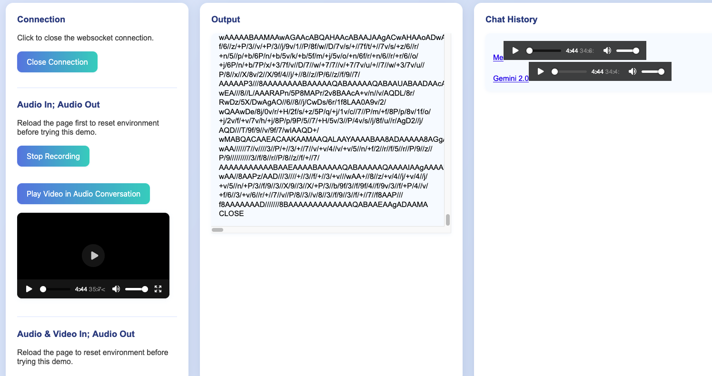
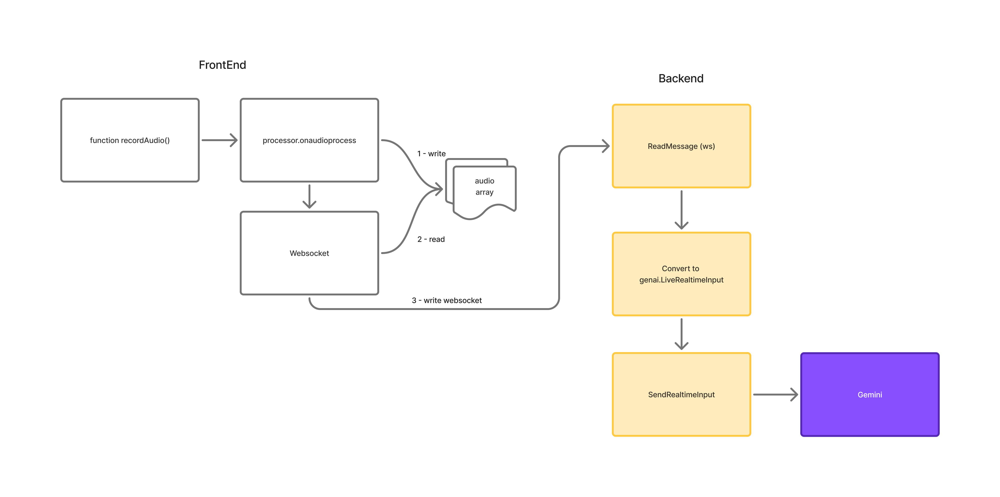
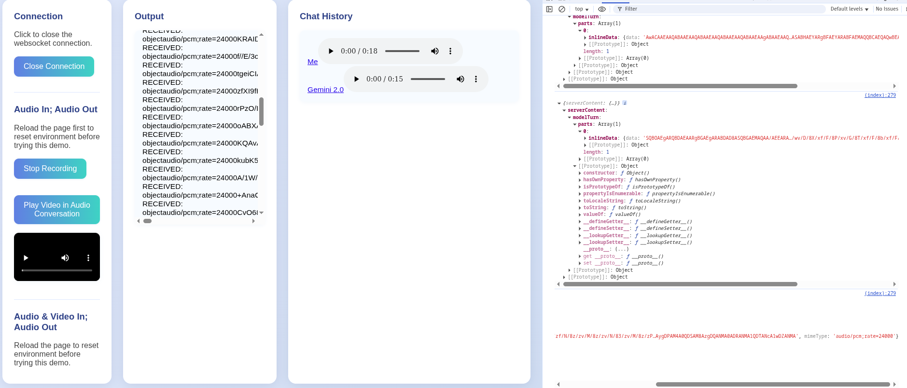

| Publish Date       | Author                                        |
| ---                | ---       |
| September 26, 2025 | Nanik Tolaram (nanikjava@gmail.com)           |
|                 |       |

# Setup

The example in this article will be run inside a GitHub Codespace for convenience, but the same instructions also work on a local development machine. Codespace provides all the Golang tooling required to run the example in this article, so no extra steps required once your codespace is launched.

The following section will walkthrough the steps needed to setup up codespace for running the code sample.

## Port

We need to setup the correct port so that we can access the application using web browser. Click on the `PORTS` tab near the bottom section of the IDE and you will option like the following:



Add port `8080` into the `Port` column as shown in the below screenshot



Once port has been added you will see the the address that this port is mapped to in the `Forwarded Address` column as shown below.




# Voice AI assistant

The example in this article demonstrate using Gemini model to build an AI application that shows the following:

* Capture audio recording in realtime using websocket.
* Playing video on the browser at the same time capturing audio recording.
* Capturing audio streaming to passthrough to LLM to be transcribe.

## Setting up

Before running the code make sure you have Gemini API key which you can obtained for free from the [Google AI Studio website](https://aistudio.google.com/).

## Running Sample

Using the Gemini API from the AI studio you can run in the terminal the example using the following command:

```
GEMINI_API_KEY=<api_key> go run main.go --host=<hostname>
```

We pass the hostname that the application is currently running on via the `--host` parameter. In this example the codespace hostname is  
`fluffy-space-goggles-jjjj549vw7hp947-8080.app.github.dev` so we run the application as follows

```
GEMINI_API_KEY=<api_key> go run main.go --host=fluffy-space-goggles-jjjj549vw7hp947-8080.app.github.dev
```

When the app launched successfully you will see logs like the following:

```
2025/09/21 20:46:42 defaulting to port 8080
2025/09/21 20:46:42 listening on port 8080 for host fluffy-space-goggles-jjjj549vw7hp947-8080.app.github.dev
```

Enter following address in your browser `http://<domain>:8080/`, you will be shown the page that looks like the following:



### Audio Conversation

Now that the application is up and running you can have a conversation with the voice assistant. Make sure the audio connection is working by seeing `OPEN` in the Output column.

You can have a conversation by clicking on the `Start Audio Conversation`. The `Output` column will print out the data transfer happening between the browser and backend while the `Chat History` will display chat voice history between yourself and the agent. You will the screen something like the following



### Audio and Video

The nice feature of the application is that you can play video by clicking on `Play Video in Audio Conversation` and at the same time having a chat with the AI agent. 

This demonstrate the possibility of using audio in browser to record and play at the same time.

## Code Diving

We will go through the internal working of the application to get an idea on how audio data are transported from the browser to the API endpoint and processed through the Gemini model. 

The following diagram shows how the different part of the application work together to transport the audio.



Let's dig into the different section of the flows

### Frontend

All of the frontend code is inside `live_streaming.html` page. The following `recordAudio` function is the crux of the audio recording operation

```
function recordAudio() {
                navigator.mediaDevices.getUserMedia({ audio: true }).then(stream => {
                    const audioContext = new AudioContext({ sampleRate: stream.getAudioTracks()[0].getSettings().sampleRate }); 
                    ...

                    processor.onaudioprocess = (e) => {
                        const inputData = e.inputBuffer.getChannelData(0); // Raw PCM data
                        const pcmData16 = convertFloat32ToInt16(inputData);
                        ...

                        if (ws && ws.readyState === WebSocket.OPEN) {
                            audioChunksSent.push(new Uint8Array(pcmData16.buffer))
                            const base64Data = arrayBufferToBase64(pcmData16.buffer);
                            ws.send(createAudioContent(base64Data));
                        }
                    };
                    ...
                });
            }
```

The function is using `AudioContext` [object](https://developer.mozilla.org/en-US/docs/Web/API/AudioContext) that give the app capability to perform audio operation.

The `.onaudioprocess` is called everytime there is an audio recording event that the application can process. Using the `inputBuffer` from the event the application reads the audio data and perform conversion. The converted data will then be sent off using websocket to the backend.

Websocket is used as transport mechanism to carry the audio data to the backend and all of the main transport operation are perform in the `openWs()` function, that is loaded when the app loaded into the browser.

```
window.addEventListener('load', function (evt) {
    ...
    function openWs() {
        if (ws) {
            return false;
        }
        ws = new WebSocket('{{.}}');
        ws.onopen = function (evt) {
            print('OPEN');
        }
        ws.onclose = function (evt) {
            print('CLOSE');
            ws = null;
        }
        ws.onmessage = function (evt) {
            data = JSON.parse(evt.data);
            ...
        }
        ws.onerror = function (evt) {
            print('ERROR: ' + evt.data);
        }
        return false;
    };
    openWs();

    ...

});
```
We have seen how the audio data are collected and transported from the user side using websocket, in the next section we will look at how the data are received and processed.

### Backend

The backend perform the heavy lifting of receiving audio data using the powerful goroutine feature from Go. All of the relevant code are inside `main.go`.

The first thing that we will look at is the different handler that handle different kind of request

```
	http.HandleFunc("/", homepage(host))
	http.HandleFunc("/live", live)
	http.HandleFunc("/proxyVideo", proxyVideo)
```

The `/` will process for accessing the main homepage while the `/live` will process the live audio recording. We will look deeper into the `live` function processing the live audio.

The `live` function perform few things, let's go through them one by one. The first thing it does is to accept websocket connection as follows:

```
func live(w http.ResponseWriter, r *http.Request) {
	...
	c, err := upgrader.Upgrade(w, r, nil)
	...
}
```

Once it's able to accept websocket connection it will then initialize the Google's go-genai SDK and specified which model to use. The code is using the [`Live`](https://pkg.go.dev/google.golang.org/genai#Live.Connect) package provided by the SDK that provide application to stream data such as audio using websocket to Google Gemini.


```
func live(w http.ResponseWriter, r *http.Request) {
	client, err := genai.NewClient(ctx, nil)
	....
	....
	session, err := client.Live.Connect(ctx, model, &genai.LiveConnectConfig{})
	...
}
```

The goroutine code below set itself up to send information to the browser once it receive content from the Gemini model.


```
func live(w http.ResponseWriter, r *http.Request) {
	...
	...

	go func() {
		for {
			...
			message, err := session.Receive()
			...
			messageBytes, err := json.Marshal(message)
			...
			err = c.WriteMessage(websocket.TextMessage, messageBytes) 
			...
		}
	}()
```

The following screenshot shows how the response sent from the backend will looked like when it is received in the browser in JSON format. 



The other side of the goroutine code that the application spin up is to receive incoming audio data from the browser which can be seen in the following code.

The received data will be converted into a special type `genai.LiveRealtimeInput` which and using the SDK `SendRealtimeInput` function will be sent to the Gemini model.

```
func live(w http.ResponseWriter, r *http.Request) {
    ...
    ...

	for {
		_, message, err := c.ReadMessage()

		....

		var realtimeInput genai.LiveRealtimeInput
		if err := json.Unmarshal(message, &realtimeInput); err != nil {
			...
		}
		...
		session.SendRealtimeInput(realtimeInput)
	}
}
```

# Summary

Building audio AI application is not hard. The basic principle behind it is to get a good understand how audio data can be transported to and from the client. In this example it is using websocket which enable quick streaming of chunks of audio data.
