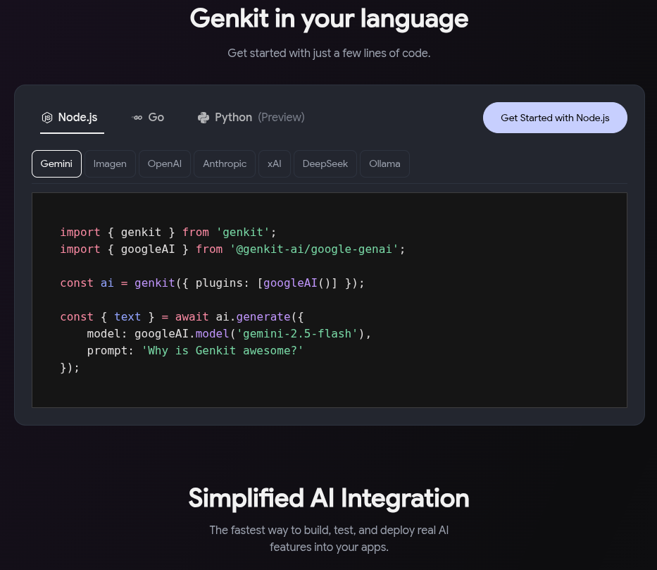
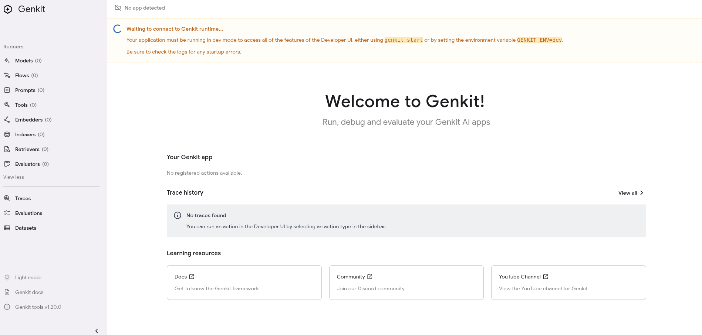

| Publish Date       | Author                                        |
| ---                | ---       |
| October 6, 2025 | Nanik Tolaram (nanikjava@gmail.com)           |
|                 |       |

# Introduction

This and subsequent articles will be a multi-series article about Genkit Go where we will look from the basic of it to developing AI using the product. But first what is Genkit Go ?.



Genkit Go according to the [website](https://genkit.dev/) in summary is an open-source AI framework for building full stack apps built by Google. As of this writing the current supported languages are - Node, Go and Python. Genkit provide not only an open-source library but a whole suite of tools to make it easy for developers to build and deploy AI applications. Gone are the worry on plumbing together different pieces of tools and libraries when building application.

The ability to deploy quickly from development to production is paramount and this is key to building product. The cherry on top is also the ability to deploy on environment such as Firebase, Cloud Run, or your own infrastructure is a life saver when time is of the essence.

We will look at the some of Genkit's features provided out-of-the-box in the following sections.

# Geting Started

To kickstart your Genkit journey we need to install the CLI tool. 

## Installing CLI

The CLI provide a lot of features that makes it easy to develop your application. This is the first step that you need to do in order to use the genkit framework effectively. The CLI will assist with the day to day operation of developing, managing and debugging your AI application without plumbing different tools.

1. Use the following command to install it in your local machine

```
curl -sL cli.genkit.dev | bash
```

You will see something like the following result showing the installation is in progress

```
-- Checking for existing genkit installation...
-- Checking your machine type...
-- Downloading binary from https://storage.googleapis.com/genkit-assets-cli/prod/linux-x64/latest
######################################################################## 100.0%
-- Setting permissions on binary... /usr/local/bin/genkit
-- Checking your PATH variable...
-- genkit@1.20.0 is now installed
-- All Done!
```

2. Once complete you can execute it on the terminal as follow:

```
genkit --help
```

This completes the step to install the CLI, next we will look at running the web UI.

## Running Web UI

The CLI provide a web app that developer will work with to make it easy to develop their AI application.

1. Run the CLI tool as follows to bring up the web application

```
genkit start
```

The first time you run the CLI tool you will see the following output in your terminal

```
Genkit CLI and Developer UI use cookies and similar technologies from Google
to deliver and enhance the quality of its services and to analyze usage.
Learn more at https://policies.google.com/technologies/cookies
Press "Enter" to continue
Indexed 0 traces in 1ms in ....
Telemetry API running on http://localhost:4033
Project root: ....
Genkit Developer UI: http://localhost:4000
```

2. Access the web application from your browser using the following `http://localhost:4000` url.



You will see a message in the app `Waiting to connect to Genkit runtime....` which is correct as currently there are no application that it can communicate with. We will look at running an application in the next article.

### Web UI menus

The menu on the left there are a number of features that you will find it useful once you start building AI applications. Let's walkthrough some of the available menu:

1. **Models** - You can interact with different Gemini models that are available. This will give you an idea which model will be suitable for your need and at the same time you can fine tune your prompt to fit the correct model. The model that you can use depends whether you have access - some are available for free while others required paid version.

2. **Flows** - Your application will be written as flows which conceptually is not far from a function. The flows that you have in your application can be viewed and tested here.

3. **Prompts** - Your AI applications will contains a pre-defined prompts that you can build using templates. The prompt can 

4. **Tools** - You will be able to perform function calling. Any tools that you have built in your applications are available here. This makes it easy to test tools that you are building or planning to use to integrate in your AI application.

5. **Embedders** - This menu will assist you in running the embedding function that you have built in your application. An embedder is the component that takes raw data (text, documents, etc.) and converts it into a vector embedding.

6. **Indexers** - The indexer works hand-in-hand with the embedder and this is where you will use the functionality to perform query that will allow search to be performed using the embedded information that you have in build in your application.

7. **Retrievers** - Retriever that you build in your AI application to pull relevant context from a knowledge source can be called and tested from this menu.

8. **Evaluators** - This will provide a way to run functions that assess whether the model’s output is correct and valid.

In the next article we will look at how to develop a simple Genkit based application that we can run locally and used the web UI to work with it.